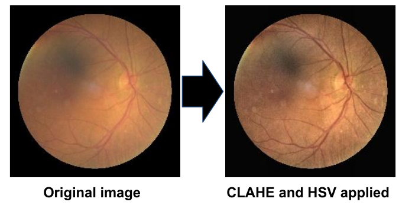

# Ocular Disease Inteligent Recognition

## Introduction: the problem

Ocular diseases are the leading cause of blindness worldwide. A large population suffers from ocular diseases like cataracts, myopia, hypertension and retinopathy. When it comes to treatment, early detection is the key as it can prevent visual impairment. Unfortunately, manual detection is usually very time consuming and there are not enough ophthalmologists for timely detection. Therefore, there has been a growing interest in developing automated detection using machine learning models as it can help revolutionise the early detection of these diseases [1]. Our team is working towards developing such a model using Convolutional Neural Networks and novel preprocessing techniques. We propose a constitutional neural network model that detects 8 different classification groups for 7 different ocular diseases: Normal (healthy), Diabetic, Glaucoma, Cataracts, Age-related macular degeneration, Hypertension, Myopia and other.

## The Dataset

We used the Ocular Disease Intelligent Recognition (ODIR-5K) dataset [5]. It contains structured data of 5,000 patients with age, colour fundus photographs of left and right eyes and diagnostic keywords from ophthalmologists. The fundus photographs were captured using various cameras like Canon, Zeiss and Kowa. Majority of the fundus images have 5K resolution. For our model we use subsets of the dataset and in some cases even the complete dataset for training.

## Previous efforts referenced

- [*A Benchmark of Ocular Disease Intelligent Recognition: One Shot for Multi-Disease Detection [1]* ](https://doi.org/10.1007/978-3-030-71058-3_11): This is the original paper associated with the ODIR-5k dataset, written by the authors of the dataset.
  
  - It establishes baseline benchmarks for the dataset by using eight deep convolutional neural networks (CNN): Vgg-16, ResNet-18, ResNet-50, ResNeXt-50, SE-ResNet-50, SE-ResNeXt-50, Inception-v4, Densenet and CaffeNet. These CNN's were referenced in inspiring our choice of CNN.
  
  - In the authors model, left and right fundus images are fed into seperate models, and a feature fusion method (element-wise sum, element-wise multiplication or concatenation) is used to combine the output of both models. The authors emphasize that an occular disease recognition model should evaluate both the left and right fundus images to provide correct diagnosis. Rather than implementing a feature fusion technique, we decided to optionally fuse left and right fundus images as part of our pre-processing pipeline.

- [*Algorithms For Massive Data [2]*](https://github.com/GrzegorzMeller/AlgorithmsForMassiveData): Our model was initially forked from the Grzegorz Meller's model. His model was chosen as a starting point due to it's relatively simple implementation (which aided us in understanding the entire model).
  
  - It is spread across a series of Jupyter Notebook's hosted on Google Colab, which are easy to quickly test and run.
  
  - We credit Grzegorz Meller for his original code which is used in our pre-processing and augmentation pipeline (though with improvements) as well as the initial setup for our various models.

- [*Ocular Disease Intelligent Recognition Through Deep Learning Architectures [3]*](https://github.com/JordiCorbilla/ocular-disease-intelligent-recognition-deep-learning): Jordi Corbilla's model was referenced in helping us pick ML CNN's and used as a guideline to implement them for our dataset.

## Machine Learning Environment

- ML Environment: [Google Colab](https://colab.research.google.com/)

- ML Framework: [TensorFlow](https://www.tensorflow.org/)

- Programming Language: [Python 3.6.9](https://www.python.org/downloads/release/python-369/)

- Pre-processing and augmentation libraries used: [OpenCV](https://opencv.org/) and [Albumentations](https://albumentations.ai/)

## Our model

Before feeding the ODIR-5k dataset to the ML model, we run the data through a pre-processing and augmentation pipeline. First, we pre-process the training data from the dataset through image enhancement. This is followed by the creating a validation set by randomly sampling 30% of the training data. Afterwards, the training data is augmented to even the distribution of images per-disease. Finally, the data is given as an input to one of the 4 models implemented. 

### Pre-processing

The pre-processing pipeline consists of the following steps:

1. **Deletion of unnecessary data:** the dataset contains images which are marked as low quality, or containing artifacts such as camera lense flare. These are removed from the training dataset to prevent them from giving incorrect bias to the ML model.

2. **Appending disease labels to image filenames:** In order to simplify the categorization of the data, each disease present in a fundus image is appended to the image's filename. This removes the need for further consulting the .csv file where the image labels are contained.

3. **Image enhancement:** Each fundus image is enhanced through a Contrast Limited Adaptive Histogram Equalization (CLAHE) and (HSV) filter to increase the clarity of the image.

4. **Left and right fundus image fusion (optional):** each left and right fundus image may be fused together into a single image by horizontally concatenating them or by performing an element-wise sum. After performing the fusion, the old left and right fundus images are removed from the dataset, so that by the end of this step only fused images remain.

5. **Creation of validation set:** 30% of the training images are removed from the training set and placed into the validation set.

6. **Image resizing:** Each image is resized to 250 X 250 pixels (or 500 X 250, if image concatenation is used as an image fusion method). This allows the model to train against the data at a faster rate, while retaining the important features of the original data.
   
   #### Image enhancement
   
   CLAHE and HSV are always applied to each image, though their parameters randomly vary within a defined range of values.  
   Below is an example of a non-enhanced image (left) and the same image after enhancement (right) [5].
   
   
   
   #### Image fusion
   
   Two image fusion techniques are implemented: element-wise sum and concatenation.
   Before the left and right fundus images may be fused together, they are resized to ensure that both images are of the same size.
- **Element-wise sum** is performed by summing each pixel from the left fundus image with the corresponding pixel from the right fundus image. Images are represented as Numpy arrays in OpenCV, and summing two Numpy results in an element-wise sum.

- **(Horizontal) image concatenation** is performed by using OpenCV's `hconcat` method.
  
  ### Augmentation
  
  After the data has been pre-processed, it is augmented to create new data from existing data. The augmentation techniques used are: horizontal and vertical flipping, random brightness increase and rotation (unless image concatenation is used as the image fusion method). Rotation is not applied to images which have been fused through concatenation, as they have a rectangular aspect ratio and rotating them would ruin the horizontal allignment of both fundus', creating an image that is not uniform with the rest of the data.

### Models
Note for each of the models we used pre-trained weights for the model layers due to the fact that it takes too long to train the model from all random weights, and it allows us to focus on improving our solutions. 

- ##### VGG16:
  
  We followed the standart implementation of the VGG16 modle using tenserflo keras. We also set all of the layers as trainable so that i learns more about the eye diseases. Only flatten layer and one Dense layers for outputs were added to the default model.
  
- ##### VGG19:
  
  We used the freely available model weights that the Visual Geometry Group used for the ImageNet competition. We ran three iterations of the model where the iteration detects Myopia, the second detects cataracts and the final one detects retinopathy.
  
- ##### InceptionV3:
  
  We followed the standard implementation of the InceptionV3 model using tenserflow keras InceptionV3 with all of the layers set as trainable with the additional layer of GlobalAveragePooling2D, and two dense layers[4].

- ##### InceptionResNetV2:
  
  For InceptionResNetV2 we also followed the standard model implementation using the Tenserflow Keras implementaiton with all of the layers marked as trainable with the additional layer of GlobalAveragePooling2D, Dropout and Dense layers[4].

## Results

### Results with InceptionV3

| Pre-processing methods used                      | 4 diseases accuracy | All diseases accuracy |
| ------------------------------------------------ | ------------------- | --------------------- |
| No image enhancement, no image fusion            | 0.9234              | **0.5681**            |
| Image enhancement, no image fusion               | 0.9275              | 0.5647                |
| Image enhancement and concatenation image fusion | **0.9381**          | 0.5459                |
| Image enhancement and sum image fusion           | 0.9094              | 0.4722                |

### Results with VGG19

| Cataracts detection accuracy | Diabetic retinopathy detection accuracy | Myopia detection accuracy |
| ---------------------------- | -------------------------------------- | ------------------------- |
| 0.9541                       | 0.8574                                 | 0.9791                    |

### Results with VGG16

| Pre-processing methods used                      | 4 diseases accuracy | All diseases accuracy |
| ------------------------------------------------ | ------------------- | --------------------- |
| No image enhancement, no image fusion            | 0.9291              | **0.5590**            |
| Image enhancement, no image fusion               | **0.9319**          | 0.5478                |
| Image enhancement and concatenation image fusion | 0.9134              | 0.5066                |
| Image enhancement and sum image fusion           | 0.8637              | 0.4659                |

### Results with InceptionResNetV2

| Pre-processing methods used                      | 4 diseases accuracy | All diseases accuracy |
| ------------------------------------------------ | ------------------- | --------------------- |
| No image enhancement, no image fusion            | 0.93                | **0.53**              |
| Image enhancement, no image fusion               | **0.94**            | **0.53**              |
| Image enhancement and concatenation image fusion | 0.93                | 0.50                  |
| Image enhancement and sum image fusion           | 0.90                | 0.45                  |

**Note:** extra decimal points were not recorded when testing with InceptionResNetV2.

## Analysis of Results

For the 4 disease case, InceptionResNetV2 performs best with image enhancement and no image fusion, with an accuracy of 0.94.

For the "all diseases" case, InceptionV3 performs best without any image enhancement or image fusion, with an accuracy of 0.5681.

From the results, the model's accuracy drops dramatically when determining between 4 and all cases. There are a few possible reasons as to why this happens. First, our model is fed data from both eyes simultaneously, so it might not learn enough about the characteristics of the disease for each eye, thus resulting in inaccurate predictions. This could be solved by creating two separate networks that respectfully target left and right eyes [1]. Another reason could be that quite a few diseases look visually the same or have the same noise, thus resulting in wrong predictions and the models learning incorrect information. Another reason could be that there are many cases in the dataset where the images themselves are either zoomed in or shifted a bit, thus creating other errors for the model during learning. Another possible solution could be to modify the CNN architecture's layers (or adding extra layers) to better detect ocular deceases. For example, we could use different pooling for our VGG16 model, add drop out layers or add dense layers at the end of the model.

### Additional notes on the results

- For 4 diseases, image enhancement improved the accuracy of the model. However, in the "all diseases" case, the accuracy drops slightly. This hints that the detection of certain disease groups (Diabetic retinopathy, Glaucoma, Hypertension and Other) do not benefit from CLAHE and HSV filters. Further research is required to determine which diseases suffer in detection accuracy when image enhancement is applied. A potential future improvement would consist of applying different image enhancements for different diseases in order to prevent a loss of accuracy when using enhanced images for the "all diseases" case. 

- The InceptionV3 performed best in the 4 disease case when image enhancement and image concatenation was used. This hints that fusing fundus images through concatenation may be a viable method for future models to use, particularly in the detection of 4 diseases (Normal, Cataracts, Myopia and Age-related macular degeneration).  

## How to run our model

1. First you need to run the preprocessing scripts provided in the `PREPROCESSING` folder. The pre-processing script must be ran first, and then the augmentation script should be ran afterwards. These scripts save everything to your Google Drive, please modify the directory where you want the files to be saved at.
   
   - **Note 1:** Running the first cell in the pre-processing script often fails (potentially due to a bug in the latency of Google Colab's filesystem). It is sufficient to simply run it a second time in order for it to succeed.
   
   - **Note 2:**  There is a `fusionMethod` variable in the pre-processing  and augmentation script that allows you to select which image fusion method is desired (or none). This variable also exists in the models and must be set consistenly across all scripts for the models to run correctly. 

2. In the `MODEL` folder you will see multiple models allowing for you to run different CNN architectures. The files are split into two main groups, four classes prediction models and all classes prediction models. (Note some models have an examples of how to run the models with our augmented data)
   
   - **Additional note:** The VGG19 model currently bypasses our pre-processing and augmentation pipeline, and can be run in it's entirety (downloading the data and training ) through it's own script. The VGG19 model has a seperate script for Myopia, Cataracts and Diabetic Retinopathy

3. Select one of the models you want to run. Currently there are 4 types of architecture available VGG16, VGG19, InceptionV3, InceptionResNetV2.

4. When opening one of the pre-processing/augmentation/model.ipynb files there should be a link to run it in Google Colab or you can download the file and run localy.

## References

- [1] Li, Ning, Tao Li, Chunyu Hu, Kai Wang, and Hong Kang. “A Benchmark of Ocular Disease Intelligent Recognition: One Shot for Multi-Disease Detection.” Benchmarking, Measuring, and Optimizing,
  2021, 177–93. [https://doi.org/10.1007/978-3-030-71058-3_11.](https://doi.org/10.1007/978-3-030-71058-3_11)
- [2] Meller, Grzegorz. “AlgorithmsForMassiveData” Github. Accessed October 3rd, 2021. [https://towardsdatascience.com/ocular-disease-recognition-using-convolutional-neural-networks-c04d63a7a2da.](https://towardsdatascience.com/ocular-disease-recognition-using-convolutional-neural-networks-c04d63a7a2da)
- [3] JordiCorbilla. “Jordicorbilla/Ocular-Disease-Intelligent-Recognition-Deep-Learning: Odir-2019. Ocular Disease Intelligent Recognition through Deep Learning Architectures.” GitHub. Accessed October 3rd, 2021.
  [https://github.com/JordiCorbilla/ocular-disease-intelligent-recognition-deep-learning.](https://github.com/JordiCorbilla/ocular-disease-intelligent-recognition-deep-learning)
- [4] Alex Alemi, "Improving Inception and Image Classification in TensorFlow". https://ai.googleblog.com/2016/08/improving-inception-and-image.html
- [5] Larxel “Ocular Disease Recognition” Kaggle. Accessed September 28th 2021
  [https://www.kaggle.com/andrewmvd/ocular-disease-recognition-odir5k/](https://www.kaggle.com/andrewmvd/ocular-disease-recognition-odir5k/)
